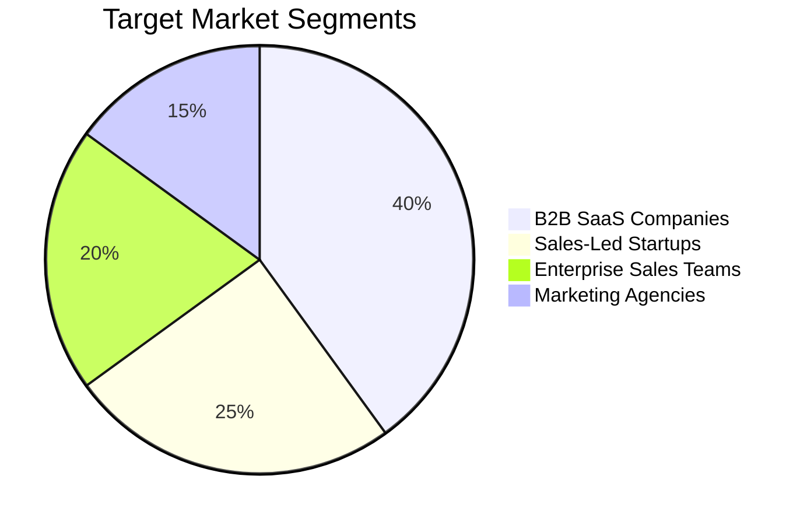
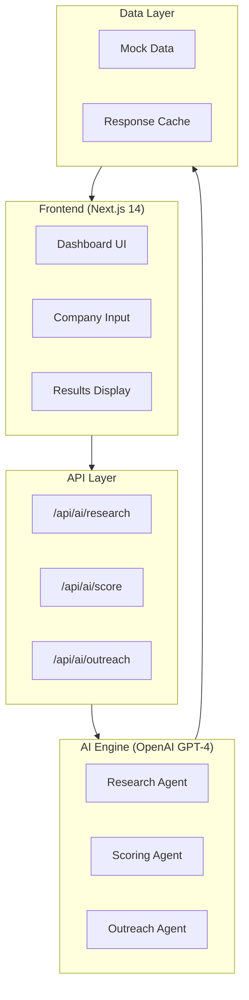
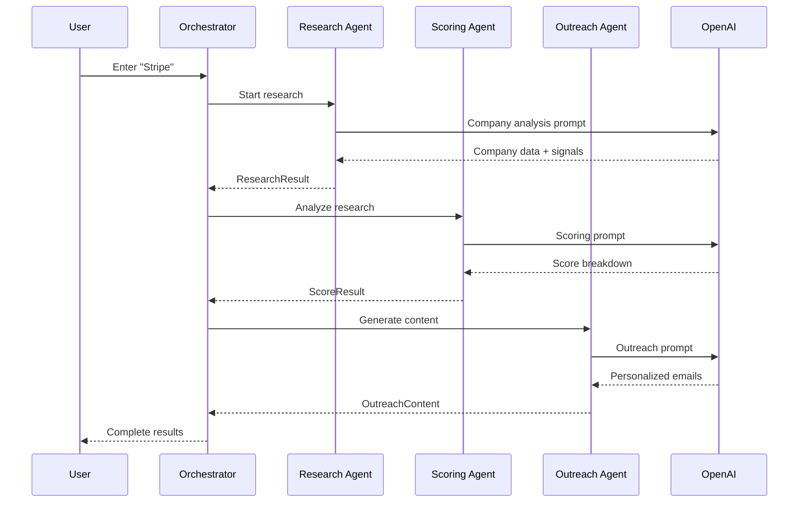
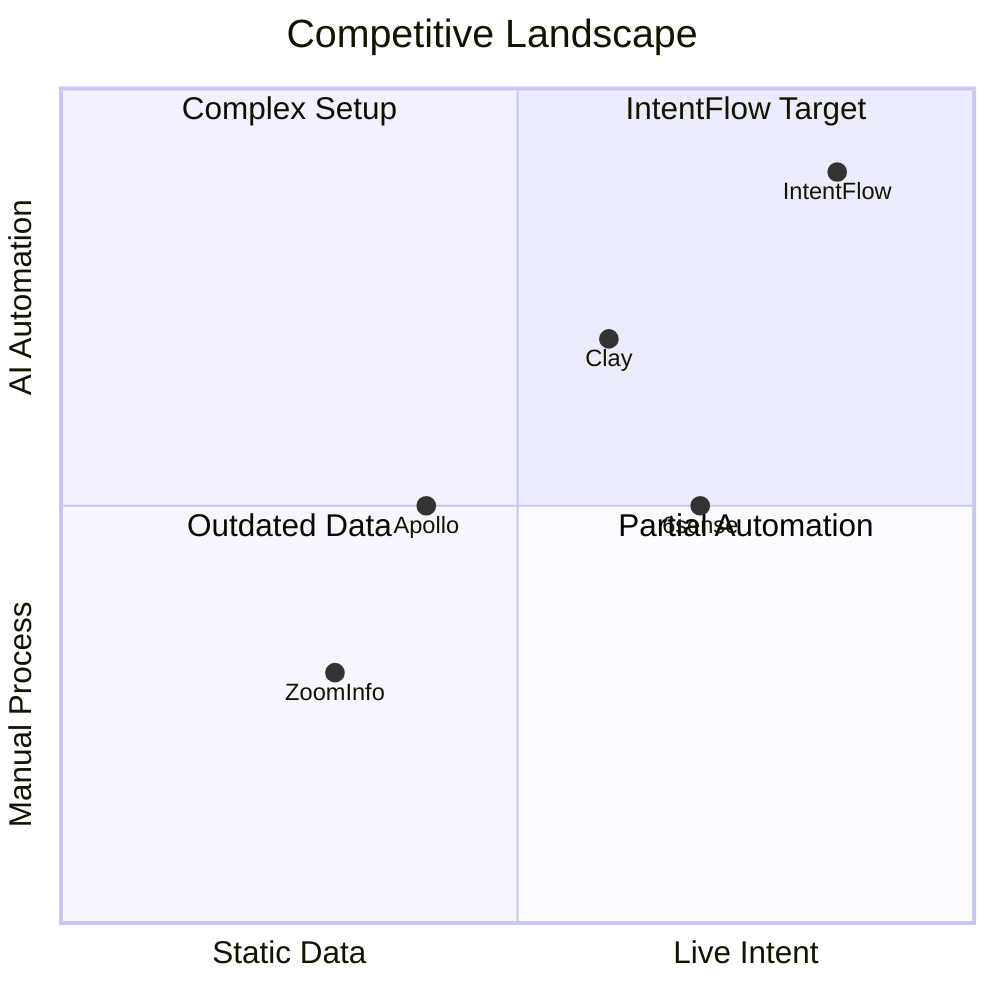

# IntentFlow: AI-Powered Outreach Automation Platform
## Comprehensive Project Report

---

## Executive Summary

**IntentFlow** is a next-generation Go-to-Market (GTM) intelligence platform that transforms real-time buyer signals into personalized, high-converting outreach. Using autonomous AI agents, the platform automates the entire prospecting workflow — from account research to personalized email generation — in under 20 seconds.


---

## Table of Contents

1. [Market Analysis](#1-market-analysis)
2. [Product Architecture](#2-product-architecture)
3. [AI Agents Deep Dive](#3-ai-agents-deep-dive)
4. [Technical Implementation](#4-technical-implementation)
5. [Feature Breakdown](#5-feature-breakdown)
6. [GTM Strategy](#6-gtm-strategy)
7. [Competitive Analysis](#7-competitive-analysis)
8. [Roadmap](#8-roadmap)

---

## 1. Market Analysis

### 1.1 The Problem

Modern B2B sales teams face critical challenges:

| Problem | Impact | Current Solutions |
|---------|--------|-------------------|
| **Static Data** | Teams chase dead leads with outdated info | ZoomInfo, Apollo (stale databases) |
| **No Intent Visibility** | Competitors win deals earlier | 6sense, Bombora (expensive, complex) |
| **Fragmented Tools** | SDRs use 8-12 tools daily | Manual switching, lost context |
| **Slow Personalization** | Hours spent per prospect | Templates, generic outreach |
| **Rising CAC** | Lower response rates | Spray-and-pray tactics |

### 1.2 Ideal Customer Profile (ICP)



**Primary Users:**
- **SDRs/BDRs** — Need faster research, better personalization
- **Sales Leaders** — Need pipeline visibility, rep productivity
- **Revenue Operations** — Need unified data, CRM sync
- **Marketing Teams** — Need intent signals for campaigns

### 1.3 Market Size

| Metric | Value |
|--------|-------|
| TAM (Sales Intelligence) | $4.8B by 2027 |
| SAM (B2B SaaS segment) | $1.2B |
| SOM (Year 1 target) | $5M ARR |

---

## 2. Product Architecture

### 2.1 System Overview



### 2.2 Technology Stack

| Layer | Technology | Purpose |
|-------|------------|---------|
| **Frontend** | Next.js 14, React 18, TypeScript | Modern React with App Router |
| **Styling** | Tailwind CSS, Custom CSS | Dark theme, glassmorphism |
| **AI** | OpenAI GPT-4o-mini | Research, scoring, content generation |
| **Icons** | Lucide React | Consistent icon system |
| **API** | Next.js API Routes | Server-side AI calls |

### 2.3 File Structure

```
intent-platform/
├── src/
│   ├── app/
│   │   ├── page.tsx                    # Main dashboard
│   │   ├── layout.tsx                  # Root layout + SEO
│   │   ├── globals.css                 # Dark theme styles
│   │   │
│   │   ├── api/
│   │   │   ├── research/route.ts       # Pipeline API
│   │   │   └── ai/
│   │   │       ├── research/route.ts   # OpenAI research
│   │   │       ├── score/route.ts      # OpenAI scoring
│   │   │       └── outreach/route.ts   # OpenAI outreach
│   │   │
│   │   └── components/
│   │       ├── dashboard/
│   │       │   ├── CompanyInput.tsx    # Search with autocomplete
│   │       │   ├── CompanyCard.tsx     # Company info display
│   │       │   ├── SignalBadges.tsx    # Intent signal chips
│   │       │   ├── ScoreGauge.tsx      # Circular score meter
│   │       │   └── ContactList.tsx     # Decision maker cards
│   │       │
│   │       ├── agents/
│   │       │   └── AgentWorkflow.tsx   # Pipeline visualization
│   │       │
│   │       └── outreach/
│   │           └── OutreachTabs.tsx    # Email/LinkedIn/Sequence
│   │
│   └── lib/
│       ├── types/index.ts              # TypeScript interfaces
│       ├── agents/orchestrator.ts      # Agent coordination
│       └── mock-data/companies.ts      # Demo company data
│
├── .env.local                          # API keys (not in git)
├── package.json
└── tsconfig.json
```

---

## 3. AI Agents Deep Dive

### 3.1 Agent Pipeline



### 3.2 Research Agent

**Purpose:** Gather comprehensive intelligence on any company

**Inputs:**
- Company name or domain

**Outputs:**
```typescript
interface ResearchResult {
  company: {
    name: string;
    domain: string;
    industry: string;
    size: 'startup' | 'smb' | 'midmarket' | 'enterprise';
    description: string;
    painPoints: string[];
    opportunities: string[];
    techStack: string[];
  };
  signals: IntentSignal[];
  contacts: Contact[];
  summary: string;
}
```

**AI Prompt Strategy:**
- Requests structured JSON output
- Focuses on actionable intelligence
- Infers data when not available
- Identifies 3-5 pain points and opportunities

### 3.3 Scoring Agent

**Purpose:** Calculate buying intent score (0-100)

**Scoring Dimensions:**

| Dimension | Weight | Factors |
|-----------|--------|---------|
| **ICP Fit** | 25 pts | Company size, industry, tech stack |
| **Timing Signals** | 25 pts | Hiring, funding, tech changes |
| **Budget Indicators** | 25 pts | Revenue, funding, headcount |
| **Engagement Likelihood** | 25 pts | Contact availability, past engagement |

**Score Interpretation:**

| Score | Label | Action |
|-------|-------|--------|
| 70-100 | 🔥 Hot | Immediate outreach, priority 1 |
| 50-69 | ☀️ Warm | SDR follow-up, nurture sequence |
| 30-49 | 💧 Nurture | Add to long-term campaign |
| 0-29 | ❄️ Cold | Disqualify or revisit later |

### 3.4 Outreach Agent

**Purpose:** Generate hyper-personalized sales content

**Outputs:**

| Content Type | Character Limit | Personalization |
|--------------|-----------------|-----------------|
| Email Subject | ~50 chars | Signal reference |
| Email Body | 3-4 paragraphs | Pain points, timing |
| LinkedIn Note | 300 chars | Mutual connection angle |
| Day 3 Follow-up | 2 paragraphs | New value angle |
| Day 7 Breakup | 2 paragraphs | Resource leave-behind |

**Personalization Strategy:**
1. Open with something about THEM (not us)
2. Reference specific signal or pain point
3. Conversational tone, no corporate jargon
4. Soft CTA (not "book a demo")

---

## 4. Technical Implementation

### 4.1 TypeScript Interfaces

```typescript
// Core data types
interface Company {
  name: string;
  domain: string;
  industry: string;
  size: 'startup' | 'smb' | 'midmarket' | 'enterprise';
  description: string;
  painPoints: string[];
  opportunities: string[];
  techStack: string[];
}

interface IntentSignal {
  id: string;
  type: 'funding' | 'hiring' | 'techChange' | 'leadership' | 
        'expansion' | 'competitorChurn' | 'websiteVisit' | 
        'g2Activity' | 'socialMention';
  strength: 'high' | 'medium' | 'low';
  description: string;
  source: string;
  detectedAt: string;
}

interface ScoreResult {
  overall: number;  // 0-100
  breakdown: {
    icpFit: number;           // 0-25
    timingSignals: number;    // 0-25
    budgetIndicators: number; // 0-25
    engagementLikelihood: number; // 0-25
  };
  recommendation: 'hot' | 'warm' | 'nurture' | 'disqualify';
}
```

### 4.2 API Routes

#### Research API (`/api/ai/research`)
```typescript
// POST request with company name
// Returns: Company profile, signals, contacts, summary
// Model: gpt-4o-mini
// Temperature: 0.7 (creative but factual)
```

#### Scoring API (`/api/ai/score`)
```typescript
// POST request with ResearchResult
// Returns: Score breakdown, recommendation
// Model: gpt-4o-mini
// Temperature: 0.5 (more deterministic)
```

#### Outreach API (`/api/ai/outreach`)
```typescript
// POST request with Research + Score + Contact
// Returns: Email, LinkedIn, Sequence
// Model: gpt-4o-mini
// Temperature: 0.8 (more creative)
```

### 4.3 UI Components

| Component | Purpose | Key Features |
|-----------|---------|--------------|
| `CompanyInput` | Search entry | Autocomplete, demo suggestions |
| `CompanyCard` | Company display | Pain points, tech stack, meta info |
| `SignalBadges` | Intent signals | Color-coded types, strength indicators |
| `ScoreGauge` | Score visualization | Animated circle, breakdown bars |
| `AgentWorkflow` | Pipeline status | Real-time progress, status messages |
| `ContactList` | Decision makers | Priority labels, department badges |
| `OutreachTabs` | Content output | Email/LinkedIn/Sequence, copy button |

### 4.4 Styling System

**Design Tokens:**
```css
--bg-primary: #0a0a0f;      /* Deep black */
--bg-glass: rgba(26, 26, 37, 0.4);  /* Glassmorphism */
--accent-gradient: linear-gradient(135deg, #6366f1, #8b5cf6, #a855f7);
--status-hot: #ef4444;
--status-warm: #f59e0b;
```

**Effects:**
- Glassmorphism cards with backdrop blur
- Gradient borders and text
- Micro-animations on hover
- Pulse animations for running agents

---

## 5. Feature Breakdown

### 5.1 Intent Signal Detection

| Signal Type | Detection Method | Strength |
|-------------|------------------|----------|
| 💰 Funding | Crunchbase, news | High |
| 👥 Hiring | LinkedIn Jobs | High |
| 🔧 Tech Change | BuiltWith, job posts | Medium |
| 👔 Leadership | LinkedIn updates | High |
| 🚀 Expansion | Press releases | High |
| 🔄 Competitor Churn | G2 reviews, job posts | Medium |
| 🌐 Website Visit | Analytics (future) | Medium |
| ⭐ G2 Activity | G2 intent data | Medium |
| 💬 Social Mention | Twitter/LinkedIn | Low |

### 5.2 Demo Companies

| Company | Score | Signals | Use Case |
|---------|-------|---------|----------|
| **Stripe** | 87/100 🔥 | Hiring 47 GTM roles, APAC expansion, CRM migration, G2 research | Hot enterprise lead |
| **Notion** | 72/100 ☀️ | New CRO, first Sales Ops hire, Series C | Warm PLG-to-Enterprise |
| **LocalBiz Software** | 28/100 ❄️ | Pre-seed only | Cold/disqualify example |

### 5.3 Outreach Templates Generated

**Email Example (Stripe):**
```
Subject: Re: Stripe's APAC expansion + sales scaling

Hi Sarah,

Noticed Stripe just announced expansion into 15 new APAC 
markets — congrats! That's a massive undertaking.

I imagine scaling your sales team globally while maintaining 
the quality bar Stripe is known for isn't trivial. Especially 
when you're also migrating CRM systems.

We've helped companies like Notion and Figma solve this exact 
challenge — turning 8-hour prospect research into 20-second 
AI-powered briefings.

Would it be worth a 15-min call to see if there's a fit?

Best,
```

---

## 6. GTM Strategy

### 6.1 Target Buyers

| Persona | Title | Pain Point | Value Prop |
|---------|-------|------------|------------|
| **Champion** | SDR/BDR | Hours wasted researching | 20-second account briefs |
| **Economic** | VP Sales | Low pipeline velocity | 4x more qualified meetings |
| **Technical** | RevOps | Fragmented tools | Single source of truth |

### 6.2 Pricing Model

| Tier | Price | Included |
|------|-------|----------|
| **Starter** | $99/seat/mo | 500 researches, 3 users |
| **Growth** | $249/seat/mo | 2,000 researches, 10 users, CRM sync |
| **Enterprise** | Custom | Unlimited, API access, dedicated CSM |

### 6.3 Competitive Positioning



---

## 7. Competitive Analysis

| Feature | IntentFlow | ZoomInfo | Clay | 6sense |
|---------|------------|----------|------|--------|
| Live Intent Signals | ✅ Real-time | ❌ Static | ⚠️ Manual | ✅ Yes |
| AI Research | ✅ 20 seconds | ❌ No | ⚠️ Requires setup | ⚠️ Limited |
| Personalized Outreach | ✅ Auto-generated | ❌ Templates | ⚠️ Manual | ❌ No |
| Scoring | ✅ AI-powered | ⚠️ Basic | ⚠️ Custom | ✅ Yes |
| Ease of Use | ✅ Instant | ✅ Easy | ❌ Complex | ❌ Complex |
| Pricing | 💲 SMB-friendly | 💲💲💲 Enterprise | 💲💲 Mid | 💲💲💲💲 Enterprise |

**Key Differentiators:**
1. **Speed** — 20-second research vs. hours
2. **AI-Native** — Not bolted on, built from ground up
3. **Personalization** — Signal-based, not template-based
4. **Simplicity** — Enter company, get results

---

## 8. Roadmap

### Phase 1: MVP (Completed ✅)
- [x] Company research with AI agents
- [x] Intent signal detection
- [x] Lead scoring (0-100)
- [x] Personalized outreach generation
- [x] Email + LinkedIn + Sequence
- [x] Copy-to-clipboard
- [x] Demo companies for presentation

### Phase 2: Integrations (Q1)
- [ ] HubSpot CRM sync
- [ ] Salesforce CRM sync
- [ ] Chrome extension
- [ ] Bulk company import (CSV)
- [ ] Team workspaces

### Phase 3: Scale (Q2)
- [ ] Real-time website visitor tracking
- [ ] G2 intent data integration
- [ ] LinkedIn activity monitoring
- [ ] Automated sequences (Outreach/Salesloft)
- [ ] Analytics dashboard

### Phase 4: Enterprise (Q3)
- [ ] Custom AI model fine-tuning
- [ ] Multi-territory support
- [ ] SOC2 compliance
- [ ] API access
- [ ] White-label options

---

## Appendix

### A. Running the Project

```bash
# Clone repository
git clone https://github.com/kunal-arora-1411/tc-group.git
cd intent-platform

# Install dependencies
npm install

# Set up environment
# Create .env.local with: OPENAI_API_KEY=your_key

# Run development server
npm run dev

# Open http://localhost:3000
```

### B. Demo Script (5 minutes)

1. **Problem Setup** (1 min)
   - Show fragmented SDR workflow
   - Mention 8-12 tools, hours of research

2. **Live Demo** (3 min)
   - Enter "Stripe" → show instant research
   - Highlight intent signals detected
   - Show score breakdown
   - Demo generated email + LinkedIn
   - Copy outreach to clipboard

3. **Vision** (1 min)
   - Roadmap highlights
   - CRM integration, bulk import
   - "20 seconds to warm outreach"

### C. Key Metrics to Track

| Metric | Target |
|--------|--------|
| Research time | < 20 seconds |
| Email open rate | > 45% |
| Reply rate | > 15% |
| Meeting book rate | > 5% |
| User retention (M1) | > 80% |

